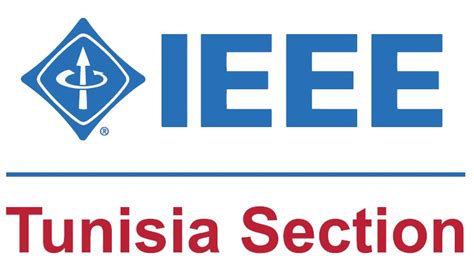
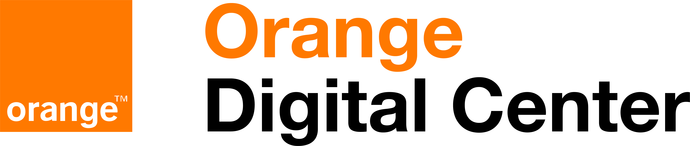

<div align="center">


&nbsp;&nbsp;&nbsp;×&nbsp;&nbsp;&nbsp;


# IEEE / Orange Digital Center — Partnership Platform

**A modern web platform managing the strategic 3-year collaboration between IEEE and Orange Digital Center.**  
Built with React 18 · TypeScript · Vite · Vanilla CSS

[](https://reactjs.org)
[](https://www.typescriptlang.org)
[](https://vitejs.dev)
[](LICENSE)

</div>

---

## 📋 Table of Contents

- [Overview](#-overview)
- [Live Features](#-live-features)
- [Tech Stack](#-tech-stack)
- [Project Structure](#-project-structure)
- [Getting Started](#-getting-started)
- [Available Scripts](#-available-scripts)
- [Public Site Pages](#-public-site-pages)
- [Admin Panel](#-admin-panel)
- [Design System](#-design-system)
- [Theming](#-theming)
- [Routes](#-routes)
- [Contributing](#-contributing)

---

## 🌐 Overview

The **IEEE / Orange Digital Center Partnership Platform** is a full-featured frontend application that serves as the public face and internal management tool for the 3-year strategic collaboration between **IEEE Region 8** and **Orange Digital Center (ODC)** in Tunisia.

The platform covers:
- Public showcase of partnership KPIs, events, and milestones
- Training catalogue (30+ programs in Mobile, Web, AI, DevOps, Game Dev)
- Voucher claim and status tracking for supported activities
- Admin panel for managing vouchers, teams, KPIs, FAQs, and the gallery

---

## ✨ Live Features

### Public Website
| Feature | Description |
|---|---|
| 🦸 **Hero Section** | Full-screen image slideshow with crossfade, animated badge, trust indicators, CTAs, and dot navigation |
| 📊 **KPI Section** | Intersection-observer count-up animation, colored icon cards, accent bars |
| 🤝 **Partnership Overview** | 3-pillar cards (Objectives / Scope / Outcomes) with hover effects |
| 🕐 **Timeline** | Zigzag 2023–2026 milestones with glowing dots and a center spine |
| 🖼️ **Events Gallery** | 6 event cards with type badges, color themes, and gradient thumbnails |
| 🔢 **Support Process** | 4-step numbered cards showing the voucher support journey |
| 💬 **Testimonials** | Auto-rotating quotes with dot navigation and fade-up animations |
| ❓ **FAQ Accordion** | Single-open React accordion with category tags and chevron animation |
| 👥 **Teams** | Horizontal partner cards with IEEE/ODC colored side stripes |
| 📧 **Newsletter** | Validated email signup with success animation |
| 📣 **Featured Banner** | Orange announcement strip linking to the training catalogue |
| 🔠 **Logo Marquee** | Infinite-scrolling partner logo strip |
| 🦶 **Footer** | 3-column links, brand logos, tagline, and copyright bar |

### Navigation & UX
| Feature | Description |
|---|---|
| 🍔 **Mobile Hamburger** | Slide-in drawer with full nav, body-scroll lock, backdrop overlay |
| ⬆️ **Back to Top** | Floating button, appears after 400px scroll, smooth scroll to top |
| ☀️/🌙 **Dark/Light Mode** | Persisted via `localStorage`, all components fully themed |
| 🔍 **Smooth Scroll** | Global `scroll-behavior: smooth` with navbar-aware `scroll-padding-top` |
| 📄 **404 Page** | Gradient "404", helpful links, catch-all route |
| 🔠 **SEO** | Dynamic `document.title` + `meta[name=description]` per page |

### Training Catalogue
| Feature | Description |
|---|---|
| 🗂️ **Filter Chips** | Category filter (AI, Mobile, Web, DevOps, Game Dev, etc.) |
| 🃏 **Program Cards** | Level badge, category tag, PDF link button, hover effect |
| 🔍 **Search** | Real-time text search across all programs |
| 📄 **PDF Links** | Direct Google Docs integration for program documentation |

### Admin Panel (`/admin`)
| Feature | Description |
|---|---|
| 📊 **Dashboard** | Stat cards with accent bars and quick-action shortcuts |
| 🎫 **Vouchers** | Full CRUD table: create, view, update status, delete |
| 👥 **Teams** | Manage IEEE/ODC contacts with modal form |
| 📈 **KPIs** | Track and update partnership impact indicators |
| ❓ **FAQs** | Add/edit/delete FAQ entries |
| 🖼️ **Gallery** | Upload and manage event photos |
| 📍 **Breadcrumb** | Auto-generated page-aware breadcrumb bar |
| 🔍 **Search** | Topbar global search input |
| 🔔 **Notifications** | Badge-equipped notification and message icons |
| 👤 **Profile Dropdown** | Avatar, menu items (Settings, Help, Sign out), outside-click close |
| 🌓 **Theme Toggle** | Admin-side dark/light mode with full coverage |
| 📱 **Collapsible Sidebar** | Fully hides to 0 width, hamburger toggle |

---

## 🛠 Tech Stack

| Layer | Technology |
|---|---|
| **Framework** | [React 18](https://reactjs.org) with functional components and hooks |
| **Language** | [TypeScript 5.9](https://www.typescriptlang.org) — strict typing throughout |
| **Build Tool** | [Vite 7](https://vitejs.dev) — HMR, glob imports, fast builds |
| **Routing** | [React Router Dom v6](https://reactrouter.com) — nested routes, `<Outlet>` |
| **Styling** | Vanilla CSS — custom design system, no CSS framework |
| **Icons** | Inline SVG — no icon library dependency |
| **Fonts** | System font stack via CSS variable |

---

## 📁 Project Structure

```
ieee-odc-frontend/
├── public/
│   ├── OIP-1215431747.jpg               # IEEE logo
│   └── ODC-RGB-black-Orange-4057230769.png  # ODC logo
│
├── src/
│   ├── assets/
│   │   ├── wallpaper/    # Hero background images (auto-loaded via glob)
│   │   └── logo/         # Partner logos for marquee strip (auto-loaded via glob)
│   │
│   ├── layouts/
│   │   ├── PublicLayout.tsx   # Navbar, mobile drawer, back-to-top, footer shell
│   │   └── AdminLayout.tsx    # Sidebar, topbar, breadcrumb, profile dropdown
│   │
│   ├── pages/
│   │   ├── LandingPage.tsx        # Main public homepage
│   │   ├── CataloguePage.tsx      # Training catalogue with filters
│   │   ├── VoucherClaimPage.tsx   # Voucher claim form page
│   │   ├── VoucherStatusPage.tsx  # Voucher status lookup
│   │   ├── NotFoundPage.tsx       # 404 catch-all
│   │   └── admin/
│   │       ├── AdminDashboard.tsx
│   │       ├── AdminVouchersPage.tsx
│   │       ├── AdminTeamsPage.tsx
│   │       ├── AdminKpisPage.tsx
│   │       ├── AdminFaqPage.tsx
│   │       └── AdminGalleryPage.tsx
│   │
│   ├── sections/                  # Public landing page sections
│   │   ├── HeroSection.tsx
│   │   ├── KpiSection.tsx
│   │   ├── PartnershipOverviewSection.tsx
│   │   ├── TimelineSection.tsx
│   │   ├── GallerySection.tsx
│   │   ├── SupportProcessSection.tsx
│   │   ├── TestimonialsSection.tsx
│   │   ├── FaqSection.tsx
│   │   ├── TeamsSection.tsx
│   │   └── NewsletterSection.tsx
│   │
│   ├── admin/                     # Admin data table components
│   │   ├── AdminVouchersTable.tsx
│   │   ├── AdminKpiTable.tsx
│   │   ├── AdminTeamsTable.tsx
│   │   ├── AdminFaqTable.tsx
│   │   └── AdminGalleryGrid.tsx
│   │
│   ├── vouchers/
│   │   └── VoucherClaimForm.tsx   # Multi-section voucher claim form
│   │
│   ├── App.tsx                    # Route definitions
│   ├── main.tsx                   # React entry point
│   └── style.css                  # Global design system (~5 000 lines)
│
├── index.html
├── vite.config.ts
├── tsconfig.json
└── package.json
```

---

## 🚀 Getting Started

### Prerequisites

- **Node.js** ≥ 18 (v22 recommended)
- **npm** ≥ 9

### Installation

```bash
# 1. Clone the repository
git clone https://github.com/m2l33k/IEEE-ODC.git
cd IEEE-ODC

# 2. Install dependencies
npm install

# 3. Start the development server
npm run dev
```

The app will be available at **[http://localhost:5173](http://localhost:5173)** (or the next available port).

---

## 📜 Available Scripts

| Command | Description |
|---|---|
| `npm run dev` | Start Vite development server with HMR |
| `npm run build` | Type-check + production build to `dist/` |
| `npm run preview` | Serve the production build locally |

---

## 🗺 Routes

| Path | Component | Description |
|---|---|---|
| `/` | `LandingPage` | Public homepage with all sections |
| `/catalogue` | `CataloguePage` | 2026 ODC training catalogue |
| `/vouchers/claim` | `VoucherClaimPage` | Multi-step voucher claim form |
| `/vouchers/status` | `VoucherStatusPage` | Check a voucher claim status |
| `/admin` | `AdminDashboard` | Admin overview with stats |
| `/admin/vouchers` | `AdminVouchersPage` | Voucher management table |
| `/admin/teams` | `AdminTeamsPage` | Team contacts management |
| `/admin/kpis` | `AdminKpisPage` | KPI tracking and editing |
| `/admin/faqs` | `AdminFaqPage` | FAQ management |
| `/admin/gallery` | `AdminGalleryPage` | Event gallery management |
| `*` | `NotFoundPage` | 404 catch-all page |

---

## 🌍 Public Site Pages

### `/` — Landing Page
The homepage is composed of independently rendered sections, each self-contained with its own data and animations:

1. **HeroSection** — full-screen slideshow, 7-second auto-advance with crossfade
2. **FeaturedTrainingBanner** — orange strip CTA to catalogue
3. **KpiSection** — animated count-up cards triggered by IntersectionObserver
4. **PartnershipOverviewSection** — objectives, scope, outcomes
5. **TimelineSection** — zigzag milestone timeline from 2023–2026
6. **GallerySection** — event cards with type badges
7. **SupportProcessSection** — 4-step voucher process
8. **TestimonialsSection** — rotating community quotes
9. **FaqSection** — accordion FAQ
10. **TeamsSection** — IEEE & ODC contact cards
11. **NewsletterSection** — email signup with validation
12. **LogoStrip** — infinite marquee of partner logos

---

## 🛡 Admin Panel

Access the admin panel at `/admin`. No authentication is currently enforced (to be added).

### Sidebar Navigation
- Dashboard
- Vouchers
- Teams
- KPIs
- FAQs
- Gallery

### Key Admin Features
- **Collapsible sidebar** — fully collapses to `width: 0`
- **Sticky glassmorphism topbar** with search, notifications, messages, theme toggle, and profile dropdown
- **Breadcrumb navigation** — auto-generated from current route
- **Profile dropdown** — avatar, role, settings, sign-out links

---

## 🎨 Design System

All styles live in a single `src/style.css` file (~5 000 lines) organized into sections:

```css
/* CSS Variables (design tokens)        */
/* Base / Reset                         */
/* Public Header / Navbar               */
/* Public Site — Hero, KPIs, Sections  */
/* Voucher Claim Page                   */
/* Admin Layout (adm- prefix)           */
/* Admin Components                     */
/* Admin Light Mode Overrides           */
/* New Feature Components               */
/* Catalogue Page                       */
```

### Design Tokens

```css
:root {
  --color-primary:        #ff7900;   /* ODC Orange */
  --color-primary-strong: #ffa533;
  --color-bg:             #060b1a;   /* Deep navy */
  --color-surface:        #0f1a30;
  --color-text:           #e2e8f0;
  --color-text-muted:     #94a3b8;
  --color-border:         rgba(148, 163, 184, 0.15);

  --radius-sm: 6px;
  --radius-md: 10px;
  --radius-lg: 16px;

  --space-xs:  4px;
  --space-sm:  8px;
  --space-md:  16px;
  --space-lg:  24px;
  --space-xl:  40px;
  --space-2xl: 64px;

  --shadow-sm: 0 4px 12px rgba(0, 0, 0, 0.2);
  --shadow-md: 0 8px 32px rgba(0, 0, 0, 0.35);
}
```

### CSS Naming Conventions

| Prefix | Scope |
|---|---|
| `pub-` | Public site components (new premium system) |
| `adm-` | Admin panel components |
| `catalogue-` | Training catalogue components |
| `btn`, `layout-` | Global shared utilities |

---

## 🌓 Theming

The app supports **dark** (default) and **light** modes.

### How it works

1. Theme is stored in `localStorage` as `ieee_odc_theme`
2. On load, the value is applied to `document.documentElement.dataset.theme`
3. All CSS overrides are scoped under `:root[data-theme='light']`
4. Toggle buttons exist in **both** the public navbar and the admin topbar

```typescript
// Toggle logic (PublicLayout.tsx / AdminLayout.tsx)
const next = theme === 'dark' ? 'light' : 'dark'
document.documentElement.dataset.theme = next
localStorage.setItem('ieee_odc_theme', next)
```

---

## 🖼 Adding Hero Images

Drop any `.jpg`, `.png`, or `.jpeg` file into `src/assets/wallpaper/`. Vite's `import.meta.glob` will automatically pick it up — no code changes needed.

```
src/assets/wallpaper/
  event-photo-1.jpg   ← auto-loaded
  event-photo-2.jpg   ← auto-loaded
```

## 🏢 Adding Partner Logos (Marquee)

Drop logo files into `src/assets/logo/`. They will automatically appear in the scrolling partner marquee at the bottom of the landing page.

```
src/assets/logo/
  partner-a.png   ← auto-loaded
  partner-b.svg   ← auto-loaded
```

---

## 🤝 Contributing

1. **Fork** the repository
2. Create your feature branch: `git checkout -b feat/my-feature`
3. Commit your changes: `git commit -m "feat: add my feature"`
4. Push to the branch: `git push origin feat/my-feature`
5. Open a **Pull Request**

### Commit Convention

```
feat:     New feature
fix:      Bug fix
style:    CSS / design changes
refactor: Code restructuring
docs:     Documentation updates
```

---

## 📄 License

This project is licensed under the **MIT License**.  
© 2026 IEEE / Orange Digital Center Partnership. All rights reserved.

---

<div align="center">

Built with ❤️ for the **IEEE / Orange Digital Center** ecosystem · Tunisia 🇹🇳

</div>
